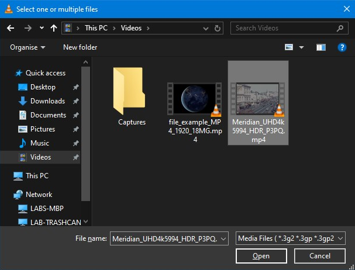
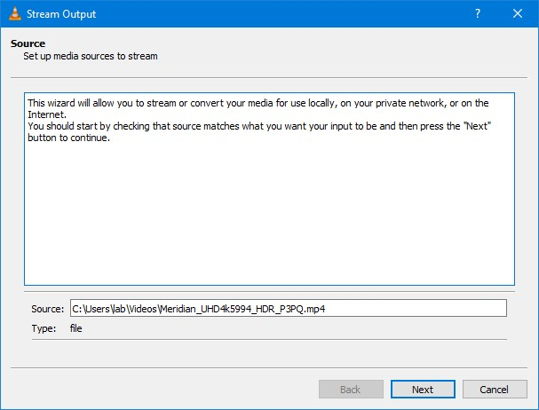
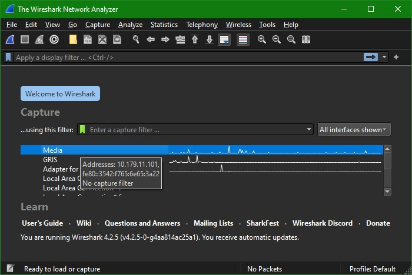
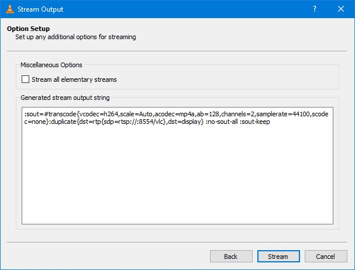

# Phase 1.1 - VLC à VLC (RTP)

## Prérequis
- Un fichier vidéo en provenance du [Netflix Open Content](https://opencontent.netflix.com/)
    - ex : *Meridian_UHD4k5994_HDR_P3PQ.mp4*
- Deux ordinateurs avec VLC (Windows ou Linux)
- Une connexion réseau entre les deux ordinateurs
- Les adresses IP des deux ordinateurs
- Connaissances de base sur le concept du [RTP](https://en.wikipedia.org/wiki/Real-time_Transport_Protocol)

## Étape 1 - Configuration de l'émetteur (Mux)
1. Sur la machine qui servira d'émetteur, ouvrir VLC
2. Dans la barre de menu, cliquer sur **Media** puis sur **Stream**.\

3. Cliquer sur **+ Add...**\

4. Choisir le fichier vidéo.\

5. Cliquer sur **Stream**.\

6. Cliquer sur **Next**.\

7. Cocher la case *Display Locally* puis sélectionner la valeur de *New Destination* à **RTP**.\
Ensuite, cliquer sur le bouton **Add**.\

8. Dans la zone *Address*, entrer l'adresse IP de la machine qui servira de moniteur.\
Donner un nom à votre flux vidéo (sans espaces idéalement).\
Ensuite, cliquer sur le bouton **Next**.\

9. Cocher la case pour *Activate Transcoding* puis cliquer sur le bouton **Next**.\
\
**Ne pas** encore cliquer sur le bouton **Stream**

## Étape 2 - Capture des paquets et lecture du flux vidéo
1. Sur la machine qui sert de moniteur, ouvrir Wireshark et sélectionner l'interface par laquelle le flux vidéo sera reçu en double-cliquant dessus.\

10. Sur la machine source, de retour dans vlc, cliquer sur le bouton **Stream**.\

11. S'assurer que la fonction de répétition (la boucle) soit en bleu.\

2. Attendre quelques secondes et arrêter la capture sur la machine moniteur.

Que pouvez-vous en conclure avec cette capture ?

## Étape 3 - Lecture du flux vidéo
1. Sur la machine qui servira de moniteur, ouvrir VLC.\
2. Dans la barre de menu, cliquer sur **Media** puis sur **Open Network Stream**.\

3. Entrer l'URL de la video. Celui-ci devrait être composé du type de transport, de l'adresse source, du port et du chemin.\
ex : *rtp://10.179.11.104:5004*\
**Ne pas encore cliquer sur *PLAY* !**\
\

