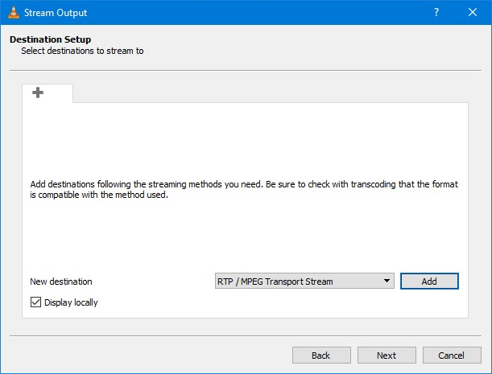
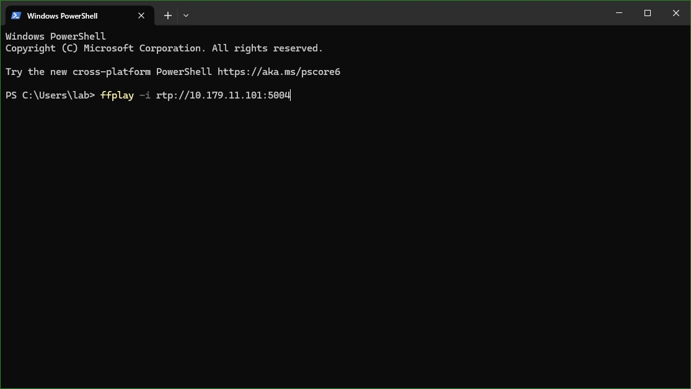
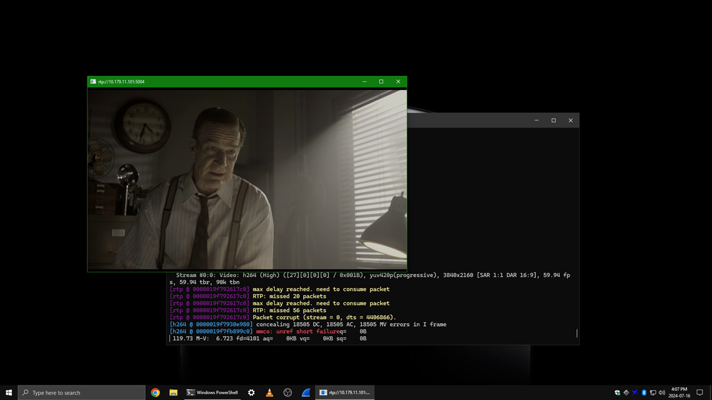

# Phase 1.1 - VLC à FFmpeg (RTP)

## Prérequis
- Un fichier vidéo en provenance du [Netflix Open Content](https://opencontent.netflix.com/)
    - ex : *Meridian_UHD4k5994_HDR_P3PQ.mp4*\
    *Si le fichier choisi est trop lourd pour votre ordinateur, en sélectionner un plus léger*
- Deux ordinateurs avec VLC (Windows ou Linux)
- Une connexion réseau entre les deux ordinateurs
- Les adresses IP des deux ordinateurs
- Connaissances de base sur le concept du [RTP](https://en.wikipedia.org/wiki/Real-time_Transport_Protocol)

## Étape 1 - Configuration de l'émetteur (Mux)
1. Sur la machine qui servira d'émetteur, ouvrir VLC
2. Dans la barre de menu, cliquer sur **Media** puis sur **Stream**.\

3. Cliquer sur **+ Add...**\

4. Choisir le fichier vidéo.\

5. Cliquer sur **Stream**.\

6. Cliquer sur **Next**.\

7. Cocher la case *Display Locally* puis sélectionner la valeur de *New Destination* à **RTP**.\
Ensuite, cliquer sur le bouton **Add**.\

8. Dans la zone *Address*, entrer l'adresse IP de la machine qui servira de moniteur.\
Donner un nom à votre flux vidéo (sans espaces idéalement).\
Ensuite, cliquer sur le bouton **Next**.\

9. Cocher la case pour *Activate Transcoding* puis cliquer sur le bouton **Next**.\
\
10. Cliquer sur le bouton **Stream**\

11. S'assurer que la fonction de répétition (la boucle) soit en bleu et/ou avec un [1].\

## Étape 2 - Lecture du flux vidéo
1. Sur la machine qui servira de moniteur, ouvrir un terminal.\

2. Dans le terminal, ouvrir le flux vidéo avec la commande `ffplay -i rtp://[adresseIP]:[Port]`.\

3. Attendre quelques secondes le temps que le flux démarre.
\
*Laisser le flux vidéo fonctionner*

## Étape 3 - Analyse des débits
1. Sur la machine moniteur, ouvrir un gestionnaire de tâches. Ouvrir l'onglet *Performance* et sélectionner l'interface utilisée pour le flux vidéo.\
***Noter la bande passante utilisée (approximative)***

2. Sur la machine source, ouvrir un gestionnaire de tâches et ouvrir l'interface utilisée pour le flux vidéo.\
***Noter la bande passante utilisée (approximative)***
\
Que pouvez-vous conclure avec vos résultats ?\
*Vous pouvez fermer le flux vidéo à ce point. \
Toutefois, il peut être intéressant de laisser jouer le flux vidéo un certain temps afin de valider la robustesse de la configuration actuelle.*

## Étape 4 - Ajout d'un flux supplémentaire
Maintenant que le flux vidéo est fonctionnel, il est temps d'ajouter une petite entrave. Il est temps d'ajouter une seconde source vidéo.\
*Pour la seconde source vidéo, vous pouvez utiliser un autre ordinateur ou bien demander à un collègue.*\

1. Sur la seconde machine source, effectuer exactement la même procédure de l'[étape 1](##-Étape-1---Configuration-de-l'émetteur-(Mux)) et [TEST](##-Prérequis)

## Étape 5 - Retour sur l'exercice
1. Effectuer un résumé de l'exercice ainsi qu'une courte explication de la situation.\
Spécifiez les protocoles, bandes passantes et autres informations nécessaires afin qu'un autre étudiant puisse comprendre la situation rapidement sans aucune information antérieure.
2. Si vous avez eu des problèmes, apporter des théories potentielles sur la cause / les causes du / des problèmes, les impacts observés ainsi que des potentiels moyens de résolution.
