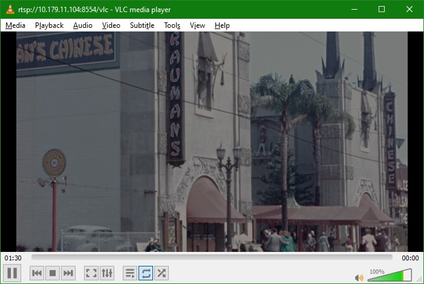
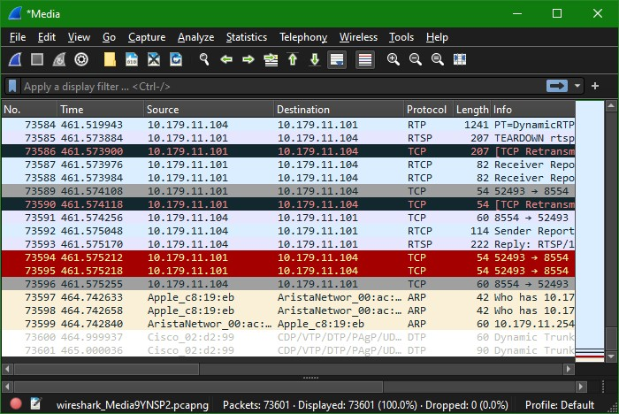
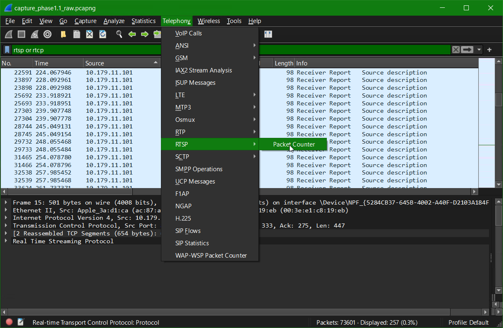

# Phase 1.2 - VLC à VLC (RTSP)

## Prérequis
- Un fichier vidéo en provenance du [Netflix Open Content](https://opencontent.netflix.com/)
    - ex : *Meridian_UHD4k5994_HDR_P3PQ.mp4*
- Deux ordinateurs avec VLC (Windows ou Linux)
- Une connexion réseau entre les deux ordinateurs
- Les adresses IP des deux ordinateurs
- Connaissances de base sur le concept du [SDP](https://en.wikipedia.org/wiki/Session_Description_Protocol) et [RTSP](https://www.rfc-editor.org/info/rfc2326)

## Étape 1 - Configuration de l'émetteur (Mux)
1. Sur la machine qui servira d'émetteur, ouvrir VLC
2. Dans la barre de menu, cliquer sur **Media** puis sur **Stream**.
3. Cliquer sur **+ Add...**
4. Choisir le fichier vidéo.
5. Cliquer sur **Stream**.
6. Cliquer sur **Next**.
7. Cocher la case *Display Locally* puis sélectionner la valeur de *New Destination* à **RTSP**.\
Ensuite, cliquer sur le bouton **Add**.
8. Prendre note du numéro de port. Puis, dans la zone *Path*, entrer le chemin `/vlc` et cliquer sur le bouton **Next**.\

9. Cocher la case pour *Activate Transcoding* puis cliquer sur le bouton **Next**.
10. Cliquer sur le bouton **Stream**.
11. S'assurer que la fonction de répétition (la boucle) soit en bleu.

## Étape 2 - Configuration du récepteur
1. Sur la machine qui servira de moniteur, ouvrir VLC.\
2. Dans la barre de menu, cliquer sur **Media** puis sur **Open Network Stream**.
3. Entrer l'URL de la video. Celui-ci devrait être composé du type de transport, de l'adresse source, du port et du chemin.\
ex : `rtsp://10.179.11.104:8554/vlc`\
**! Ne pas encore cliquer sur *PLAY* !**\

## Étape 3 - Capture des paquets et lecture du flux vidéo
1. Ouvrir Wireshark et sélectionner l'interface par laquelle le flux vidéo sera reçu en double-cliquant dessus.\

2. Retourner sur VLC puis cliquer sur **Play**.\

3. Vérifier que la vidéo est bien fluide.
    - *À considérer : Certains fichiers vidéo proposés par Netflix peuvent être trop lourd pour certains ordinateurs et causer des problèmes*
4. Laisser le flux vidéo jouer pendant au moins 30 secondes.\

5. Fermer VLC.
6. Sur Wireshark, arrêter la capture de paquets.\

## Étape 4 - Analyse des paquets
1. Dans la capture Wireshark, appliquer le filtre `rtsp or rtcp`.
2. Observer l'échange RTSP.
    - *Quelles sont les étapes de l'échange et quelles sont les informations échangées ?*
3. Dans l'onglet *Telephony* de la barre de menu, sélectionner *RTSP* puis *Packet Counter*.\

4. Observer les statistiques et déterminer si l'échange s'est passé parfaitement.
    - *Note : Cette page peut être **très** utile pour un survol d'un échange RTSP*

## Étape 5 - Retour sur l'exercice
1. Effectuer un résumé de l'exercice ainsi qu'une courte explication de la situation.\
Spécifiez les protocoles, bandes passantes et autres informations nécessaires afin qu'un autre étudiant puisse comprendre la situation rapidement sans aucune information antérieure.
2. Si vous avez eu des problèmes, apporter des théories potentielles sur la cause / les causes du / des problèmes, les impacts observés ainsi que des potentiels moyens de résolution.