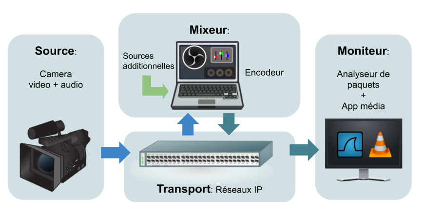

Laboratoire: Introdution au Média sur IP
----------------------------------------

Sponsorisé par:

# Contexte

Ce laboratoire consiste à mettre en application des concepts de réseautique pour le transport de
contenu audiovisuel et à se familiariser avec des outils logiciels de traitement de ce même contenu.
Les concepts abordés s’appliquent à de réelles situations de production média _live_ ainsi qu’aux
réseaux de distribution par câble, satellite  ou _web_. Les ressources à moindre coût employées dans
cet exercice sont basées sur du matériel aussi générique que possible, sur des logiciels libres et
des protocoles de transport/contrôle média standards.

# Pré-requis

* modèle OSI
* concept de routage, couches 2 et 3
* expérience avec Wireshark
* expérience avec en configuration de commutateur/routeur
* (terminal Linux)
* (base de Python)

# Objectifs d’apprentissage

## Compétences

Le but de l'exercice est de bâtir une chaîne de traitement média _live_ afin d'obtenir un programme,
c'est-à-dire un flux audiovisuel distribuable. La réalisation de ce produit est semé d'embûches
réalistes mais la méthodologie rigoureuse employée permet de les surmonter par de la validation
systématique. Les tâches suivantes visent à développer cette méthodologie permettant d'opérer
horizontalement (aux differents points du chemin de données) et verticalement (à travers les
différentes couches technologiques).

* __installer et configurer__ les équipements d’une chaîne de production afin de produire un contenu en direct
* __déboguer__ le chemin du flux de donnée
* __mesurer__ le trafic à différents points du réseau
* __juger__ la qualité du résultat
* __identifier__ les contraintes techniques compromettant cette qualité perceptuelle
* __tester__ et fixer différents paramètres afin de trouver le meilleur compromis  

Un autre but de cette démarche est de créer un pont cognitif entre l'osbervation de
données très bas niveau et l'expérience du média temps réel.

## Connaissances 

Réseaux:

* __encapsulation__ IP: UDP vs TCP, RTP
* __routage__ couche 2: unicast ou multicast, IGMP

Média:

* __protocoles__ de transport: 2110, mpeg-TS
* __codecs__: h264, aac
* __contraintes__: qualité du signal, bande passante, délai

La section [Idées](#idees) liste une série de concepts additionnels qui pourraient être explorés.

# Aperçu

*[Diagramme source](https://docs.google.com/drawings/d/1q6MF5KY4nLmCBxLiehqOJvOSK_qoAchkg8bCS-ulvEI/edit)*

Le point de départ est une caméra qui fournit le
signal source qu'il faut véhiculer sur un réseau IP. Puis un mixeur permettra d'insérer d'autres
éléments graphiques ou sonnores (fichiers, _webcam_ etc.) et permettra aussi d'ajuster certains
paramètres (colorimétrie, volume sonore, etc.). Ce résultat sera finalement compressé et converti
dans un format adapté au transport sur Internet.

# Requis techniques

* 2 PCs
* commutateur Cisco simple
* une caméra IP
* logiciels libres: VLC, OBS, etc. Wireshark

[Guide de l'instructeur.](./guide-instructeur.md)🤓

# Déroulement

1. préparation et branchement du matériel: une source (caméra) + un canal (réseau) + une destination (moniteur)
2. configuration d’une chaîne média simple
3. insertion d'un équipement inconnu
4. utilisation d’un mixeur et ajout de nouvelles sources 
5. formatage du flux de sortie

[C'est parti!](./laboratoire.md)🚀

#  Idées

Un ou plusieurs modules pourraient compléter le laboratoire, notamment:

* _scripting_ + HTTP: le contrôle et/ou surveillance d'équipements et de services à travers un _webAPI_
* réseau: optimisations avec VLAN, QoS
* administration système: une partie _Linux Shell_ qui est de plus en plus utilisé dans l'industrie
* infonuagique: la distribution du signal de sortie sur une platforme en ligne
