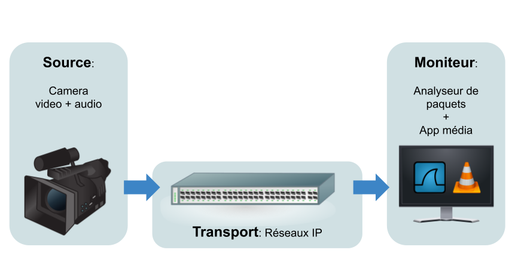
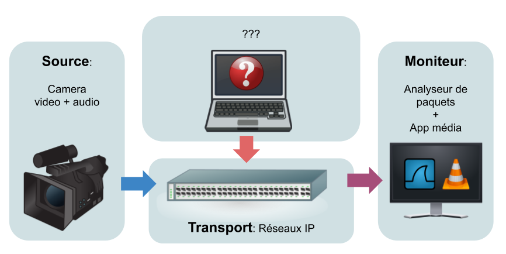

Laboratoire: Intro au Média sur IP
----------------------------------

# Phase 1: préparer le matériel 

*[Diagramme source](https://docs.google.com/drawings/d/1CZXJb9VgcKqT9M0tsVFD6_huqsBrnm8NyrAL9IfMmnI/edit)*

## Caméra

* [ A DETAILLER ]
* Connecter au commutateur, Port1
* Prendre note de l’IP de l’appareil 
* Configurer avec une IP destination dans le range multicast et avec un port
    * 💡 exemple: `225.0.0.1:5000`
    * ❓ Saviez-vous qu’il existe une relation entre les IPs multicast et l’adresse MAC? Tenter de définir la vôtre (google).

## PC moniteur

* Connecter au commutateur, Port10
* Ouvrir une session sur le PC
* Ouvrir un terminal (Win & Linux) ou Putty.exe (Win)
* Se logger sur le commutateur
    * `ssh [SWITCH_USER]@[SWITCH_IP]` pass:`[SWITCH_PASS]`

# Phase 2: Installation d’une chaîne média simple

*[Diagramme source](https://docs.google.com/drawings/d/1q6MF5KY4nLmCBxLiehqOJvOSK_qoAchkg8bCS-ulvEI/edit)*

## Moniteur

* Vérifier la présence des paquets venant de la source entrant avec Wireshark et les inspecter
    * ❓ Question: UDP, RTP, timestamp
* Ouvrir VLC et tenter de lire le stream 
    * url: `udp://225.0.0.1:5000`
* (Windows) ça ne marche pas, il faut ajouter une permission à VLC dans le pare-feu, puis réessayer
    * ❓ En déduire le fonctionnement Wireshark par rapport aux autre applications
* Évaluer la qualité et mesurer les caractéristiques de l’image et du son
* Fermer VLC mais laisser Wireshark et la session SSH ouverts

## Commutateur: configurer l’IGMP

* Observer le débit dans le port entrant (caméra) et d’autres port
    * `sh int et0`
    * ❓ En déduire le mode de fonctionnement actuel de la switch (flooding)
    * ❓ Réfléchir si c’est souhaitable (non).
* Activer le IGMP snooping sur le commutateur
* Constater la perte de signal et observer à nouveau le débit sortant sur les ports

## Moniteur

* Relance VLC pour rétablir l'image
    * ❓ Déduire le principe de broadcast vs multicast
* Chercher les paquets IGMP dans Wireshark
    * 💡 filtre = `igmp`
    * ❓ Interpréter le fonctionnement du protocol IGMP

# Phase 3: insertion d’un équipement inconnu

*[Diagramme source](https://docs.google.com/drawings/d/1g69jHkFmMmtmeYx_w6pYkU2EEvJdAaBjWFwXzCenr1w/edit)*

## PC mixeur

* Brancher le PC mixeur au commutateur Port5
* Allumer

## Moniteur
* Observer la dégradation de l’image dans VLC
* Chercher les paquets multicast dans Wireshark
    * 💡 filtre = `ip.dst == 225.0.0.1`
* Trouver l’existence d’un autre flux avec la même adresse de destination en regardant les adresses 
    * 💡 filtre = `ip.dst == 225.0.0.1 && ip.src != …`

## Commutateur

* Confirmer l’origine des paquets parasites à partir d’informations 
    * 💡 `ip mroute …`

## PC mixeur

* Identifier le processus coupable et le fermer
    * 💡 `netstat -laputen` (Linux)

# Phase 4: Utilisation d’un mixeur

*[Diagramme source](https://docs.google.com/drawings/d/1g69jHkFmMmtmeYx_w6pYkU2EEvJdAaBjWFwXzCenr1w/edit)*

## PC mixeur

* Ouvrir OBS (*Open Broadcast Studio*)
* Ajouter une source live et s’abonner au flux caméra 
* OBS: ouvrir une ou plusieurs sources additionnelles (webcam, fichier vidéo/son, images) et les intégrer dans l’image
* Générer un flux Mpeg-TS en sortie avec une autre IP multicast (exemple: 225.0.0.2:5000) 

## Commutateur

* Mesurer le débit du port Caméra maintenant qu’il a 2 demandeurs
* Comparer avec précédemment quand il n’y avait qu’un seul demandeur
    * ❓ Constater l’avantage du multicast pour des souscriptions multiples
    * ❓ Quel est l’intérêt du UDP dans ce cas-ci?

## Moniteur

* Ajuster VLC sur cette nouvelle IP:port pour recevoir le résultat 

# Phase 5: Formation du signal de sortie

*[Diagramme source](https://docs.google.com/drawings/d/1q6MF5KY4nLmCBxLiehqOJvOSK_qoAchkg8bCS-ulvEI/edit)*

